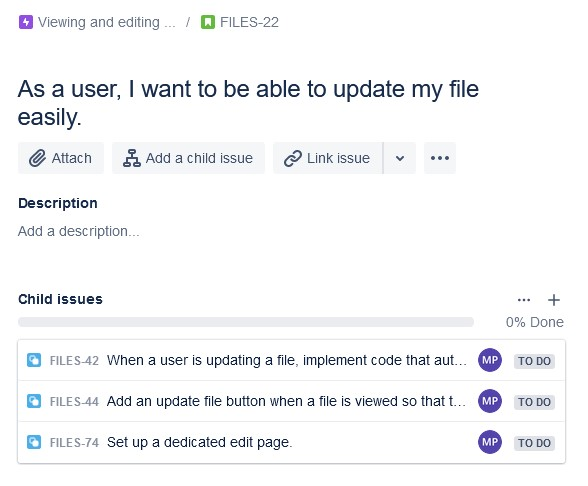
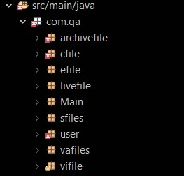

# **Files**
## _Repository that stores the files project_
---
## Table of contents

* [Introduction](#Introduction)
* [Planning](#Planning)
* [Screenshots](#Screenshots)
* [Detailed analysis](#Detailed-analysis)
* [Risk assessment](#Risk-assessment)
* [Possible future extensions](#Possible-future-extensions)
* [Frameworks used](#Frameworks-used)
* [Acknowledgements and contributors](#Acknowledgements-and-contributors)
* [Licencing](#Licencing)
* [Version-control](#Version-control)

### **Introduction**
Files is a project aimed to provide an easy way enables anyone to write anything with minimal hassle. What the person chooses to write might be as short as a grocery list or could be longer than a news article. Every file has a title and a label along with content to help easily identify it. 

Files uses Java and SQL for the backend and implements HTML, CSS and JavaScript for the front end. This README will cover how the project was developed and how it can be used.

### **Planning**
To plan for the project, I used Jira which allows its users to create Epics, user stories and finally tasks. I split my epics into three sections: Navigating, Viewing and editing files, and Creating files. 

These epics hosted seven different user stories which in themselves hosted different tasks that needed to be completed. 

I created a sprint called “Files Sprint 1” to easily track my progress on different tasks and see what needed to be done and what had been achieved very clearly.

### **Screenshots**
Here are screenshots of what Files currently looks like from a user’s perspective:
*Create a file:*

*See all files:*

*See a specific file:*

*See files grouped by label:*

*Update a file:*

*Task success:*

*Query error:*

### **Detailed analysis**
Files uses one database table to include all information. This database, called “Livefile”, is laid out as shown in the image below. It has four main columns: record_id (the primary key), title, label and content.

This database implements CRUD functionality and can therefore enable users to:
* Create a file
* See every file
* See an individual file
* See a list of files grouped by the label
* Edit a file
* Delete a file

I have used the Spring Boot Framework that works extremely efficiently and helps execute CRUD functionality easily in Java. For SQL, I have used the local H2 console for this project. All the frameworks used to develop Files can be found in the [Frameworks used](#Frameworks-used) section.

For testing, I have conducted both integration and unit tests which currently have no errors out of the 25 tests I have ran using JUnit. 

In addition to testing the backend, I have also tested my front end code to ensure it functions well and correctly displays and alters data. For my front end, I have tested simply using the browser to display the web application and check if the application acts as expected.

I have also tested my application using Junit and Mockito with a coverage of over 98%. 

When coding both the front end and the back end, I have used the best design principles. I have ensured that I don’t have to repeat myself and that my code is easily readable and arranged in a coherent order so that it can be modified easily by any other developer.

Initially I had an incoherent structure to my Java project based on front-end pages (see image below).

This was too complicated and confusing. As the project went on, I decided to simplify my approach and  adopt a more coherent structure for both Java and the front end.
*Java main:*

*Java test:*

*Java resources:*

*Front end:*

### **Risk assessment**
There are various risks associated with this project divergent in severity and probability. For both probability and severity, I have rated each risk with one of five values: Very high, High, Medium, Low or Very Low. Please refer to the images below.

### **Possible future extensions**
There are particularly interesting ways to possibly extend this project and make it much more useful to its users. The most obvious is to add the functionality to log in as a particular user and then offer users the option to either keep their files public or make them private and only accessible to them.

Another possible functionality that can be added to this project is an archive option. This option will automatically save the old version of a file when a file is updated and thus older file contents can conveniently be accessed again. This feature could then be turned off in settings if convenient for the user or the archives can be deleted when the file is deleted. See the Entity Relationship Diagram for this below.

Furthermore, there is also the possibility to customise text decorations, font types and the addition of other features like bullet points for file content so that the user can customise their files easily.

### **Frameworks used**
I have used a variety of different frameworks, APIs, extensions and tools to assist me when creating this project. I have used the following:
*	[Jira](https://www.atlassian.com/software/jira)
*	[Maven](https://maven.apache.org)
*	[Spring](https://spring.io)
*	[Lombok](https://projectlombok.org)
*	[Mockito](https://site.mockito.org)
*	[Postman](https://www.postman.com)
*	[Swagger](https://swagger.io)
*	[Bootstrap](https://getbootstrap.com)

### **Acknowledgements and contributors**
Throughout this project, I was guided by the trainers at the QA academy. This project was completed solely by [me](https://github.com/MP-Prime).

### **Version control**
I used Github to control the version of the project but also made multiple duplicates of the projects at various timeframes to ensure I had a backup.

### **Licencing**
This code is made available under the MIT license. See the license below.

---
The MIT License (MIT)

Copyright (C) Moksh Pandya

Permission is hereby granted, free of charge, to any person obtaining a copy

of this software and associated documentation files (the "Software"), to deal

in the Software without restriction, including without limitation the rights

to use, copy, modify, merge, publish, distribute, sublicense, and/or sell

copies of the Software, and to permit persons to whom the Software is

furnished to do so, subject to the following conditions:

The above copyright notice and this permission notice shall be included in all

copies or substantial portions of the Software.

THE SOFTWARE IS PROVIDED "AS IS", WITHOUT WARRANTY OF ANY KIND, EXPRESS OR

IMPLIED, INCLUDING BUT NOT LIMITED TO THE WARRANTIES OF MERCHANTABILITY,

FITNESS FOR A PARTICULAR PURPOSE AND NONINFRINGEMENT. IN NO EVENT SHALL THE

AUTHORS OR COPYRIGHT HOLDERS BE LIABLE FOR ANY CLAIM, DAMAGES OR OTHER

LIABILITY, WHETHER IN AN ACTION OF CONTRACT, TORT OR OTHERWISE, ARISING FROM,

OUT OF OR IN CONNECTION WITH THE SOFTWARE OR THE USE OR OTHER DEALINGS IN THE

SOFTWARE.

